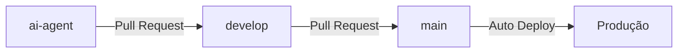

# Guia de Contribuição

## Estrutura de Branches

Este projeto utiliza três branches principais:

### 🤖 `ai-agent` - Lovable/IA
- Branch conectada ao Lovable
- Todas as mudanças feitas pela IA vão para esta branch
- **Não fazer push direto - somente via Lovable**

### 💻 `develop` - Desenvolvimento Local
- Branch para desenvolvimento e testes locais
- Revisar e testar mudanças da branch `ai-agent`
- Integrar features antes de produção

### 🚀 `main` - Produção
- Branch protegida
- Somente código testado e aprovado
- Deploy automático para produção

## Fluxo de Trabalho



### 1. Mudanças via Lovable (IA)
```bash
# Lovable faz commit automaticamente em ai-agent
# Após revisão, criar Pull Request:
ai-agent → develop
```

### 2. Desenvolvimento Local
```bash
# Clonar repositório
git clone [repo-url]
cd cotiza-tu-plan-hoy

# Trabalhar na branch develop
git checkout develop
git pull origin develop

# Fazer mudanças
git add .
git commit -m "feat: descrição da mudança"
git push origin develop
```

### 3. Merge para Produção
```bash
# Após testes em develop
# Criar Pull Request no GitHub:
develop → main

# Após aprovação e merge, deploy automático
```

## Configuração Inicial

### Para o Desenvolvedor:
```bash
# Clonar e configurar
git clone [repo-url]
cd cotiza-tu-plan-hoy
git checkout develop
npm install
npm run dev
```

### Para o Lovable:
1. Conectar GitHub no Lovable
2. Ativar "GitHub Branch Switching" em Account Settings > Labs
3. Selecionar branch `ai-agent`

## Regras de Proteção

### Branch `main`:
- ✅ Require pull request reviews
- ✅ Require status checks to pass
- ❌ Disable direct pushes

### Branch `develop`:
- ✅ Require pull request from ai-agent
- ⚠️ Permitir push direto para desenvolvedor

### Branch `ai-agent`:
- ⚠️ Somente Lovable tem acesso
- ✅ Require pull request para develop

## Padrões de Commit

Seguimos [Conventional Commits](https://www.conventionalcommits.org/):

- `feat:` - Nova funcionalidade
- `fix:` - Correção de bug
- `docs:` - Documentação
- `style:` - Formatação, estilo
- `refactor:` - Refatoração de código
- `test:` - Testes
- `chore:` - Tarefas de manutenção

### Exemplos:
```bash
git commit -m "feat: adicionar formulário de contato"
git commit -m "fix: corrigir validação de email"
git commit -m "docs: atualizar README com instruções"
```

## Stack Tecnológica

- **Framework**: React + Vite
- **Linguagem**: TypeScript
- **Estilização**: Tailwind CSS
- **Componentes**: shadcn/ui
- **Animações**: Framer Motion
- **Roteamento**: React Router DOM
- **Formulários**: React Hook Form + Zod
- **Analytics**: Google Analytics 4

## Comandos Úteis

```bash
# Desenvolvimento
npm run dev              # Iniciar servidor de desenvolvimento

# Build
npm run build           # Build para produção
npm run preview         # Preview do build

# Linting
npm run lint            # Verificar código

# Instalação de dependências
npm install [package]   # Instalar pacote
```

## Estrutura do Projeto

```
src/
├── components/
│   ├── home/          # Componentes da página inicial
│   ├── layout/        # Header, Footer
│   ├── shared/        # Componentes compartilhados
│   └── ui/            # Componentes shadcn/ui
├── lib/               # Utilitários e helpers
├── pages/             # Páginas da aplicação
└── data/              # Dados estáticos

public/
├── robots.txt
└── sitemap.xml
```

## Suporte

Para dúvidas ou problemas:
1. Verificar documentação no README.md
2. Revisar issues abertas no GitHub
3. Criar nova issue com label apropriada

---

**Nota**: Este projeto está em desenvolvimento ativo. Sempre sincronize com a branch `develop` antes de iniciar novo trabalho.
